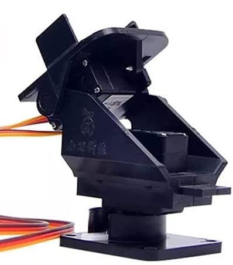
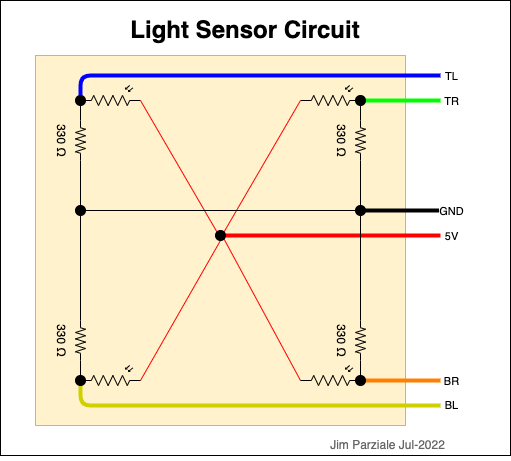
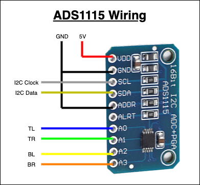

# LightTracker

## Overview
Code to control a robotic arm using 4 light-dependent-resistors to move to face the brightest light source.

## External Dependencies

* [pigpio](https://github.com/joan2937/pigpio)  
  C library for the RaspberryPi which allows control of the General Purpose Inputs/Outputs (GPIOs).

---

## Design

### Software Modules

* I2CDev  
  Provides a class interface to the Linux kernel's I2C access on the RaspberryPi board.

* ADS1115  
  Provides a class interface to the ADS1115 Analog-to-Digital chip using the I2C bus.  
  This depends on the I2CDev class.

### Control Loop

The control loop is an infinite loop in the main program that performs the following tasks:

* Read values from the ADC chip for the 4 light sensors
* Convert the 4 light values into directional values
* Compute the step size for azimuth movement (left-right), updating azimuth position
* Compute the step size for elevation movement (up-down), updating elevation position
* Command the azimuth and elevation servos using the computed positions

### Tracking Algorithm

The light sensors are arranged at the corners of a physical square on their circuit board,
each pointing slightly away from the other three sensors to cover a wide sensing range.  
* TL (top left)     : attached to A0 on the ADC chip
* TR (top right)    : attached to A1 on the ADC chip
* BL (bottom left)  : attached to A2 on the ADC chip
* BR (bottom right) : attached to A3 on the ADC chip

Updated azimuth and elevation positions are computed as follows:

* Get filtered values from the light sensors  
  For each sensor, the A-to-D value is read 8 times and averaged, creating a filtered value.  
  The value read is in milliVolts, from 0.0 (complete darkness) up to 6144.0 (highest light),  
  although the highest values observed given the circuitry is around 4500 mV.

* Multiply these values by compensation factors. These factors were computed from observation  
  of the outputs of the sensors given the same light intensity inputs. These values are  
  also tweaked later to get the device to point directly at the light source.
```
  TL = A0 * A0_Compensation
  TR = A1 * A1_Compensation
  BL = A2 * A2_Compensation
  BR = A3 * A3_Compensation
```

* Convert the filtered light sensor values into directional values (top, bottom, left, right)
```
  Top    = (TL + TR) / 2.0
  Bottom = (BL + BR) / 2.0
  Left   = (TL + BL) / 2.0
  Right  = (TR + BR) / 2.0
```

* Compute the step size for azimuth movement, applying a scale factor so the step size isn't too big or too small.
  For this project, the scale worked out to be 2.0 by experimentation.
```
  AzStep = (Right - Left) / scale  
  ElStep = (Bottom - Top) / scale  
```

* Update the azimuth and elevation positions
  Both positions start out as the middle position for both servos. The position is updated by adding the
  new step size to the current position.
```
  AzPosition += AzStep  
  ElPosition += ElStep  
```

---

## Hardware Setup

The following describes the hardware used for this project.

### ***Tracker Arm***

The tracker arm consists of two servo motors: one controls 180 degrees of left-right direction (azimuth),  
and the other controls about 100 degrees of up-down direction (elevation from straight up to slightly
below the horizon).



### ***Light Sensor Board***



### ***ADS1115 Analog-to-Digital Wiring***



---
